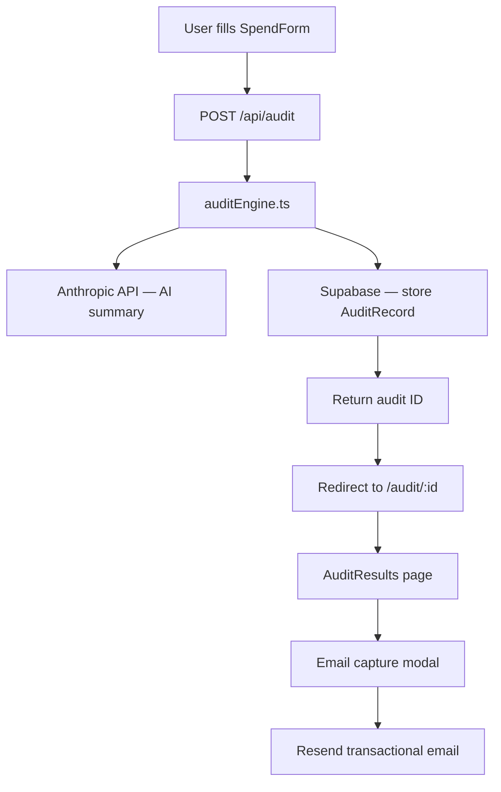

# ARCHITECTURE.md

> To be completed by Day 3. See DEVLOG.md for progress.

## System Diagram

## Data Flow

1. User input (AuditFormState) → POST /api/audit
2. auditEngine evaluates each enabled tool → ToolAuditResult[]
3. Anthropic API generates personalized summary paragraph
4. AuditRecord stored in Supabase with nanoid slug
5. Client redirected to /audit/:id — shareable, PII-stripped public URL

## Stack Choice

- **Next.js 14** — App Router, Server Actions, easy Vercel deploy
- **TypeScript strict** — financial logic needs type safety
- **Tailwind CSS** — utility-first, no runtime overhead
- **Supabase** — managed Postgres, free tier sufficient for MVP
- **Resend** — generous free tier (100 emails/day), excellent DX

## Scale Considerations (10k audits/day)

- Move audit engine to Edge Runtime — stateless, sub-100ms
- Add Redis (Upstash) for rate limiting instead of in-memory
- Supabase connection pooling via PgBouncer (already included)
- CDN-cache public audit result pages (they're immutable after creation)
- Offload Anthropic API calls to a queue (BullMQ / Inngest) with fallback
