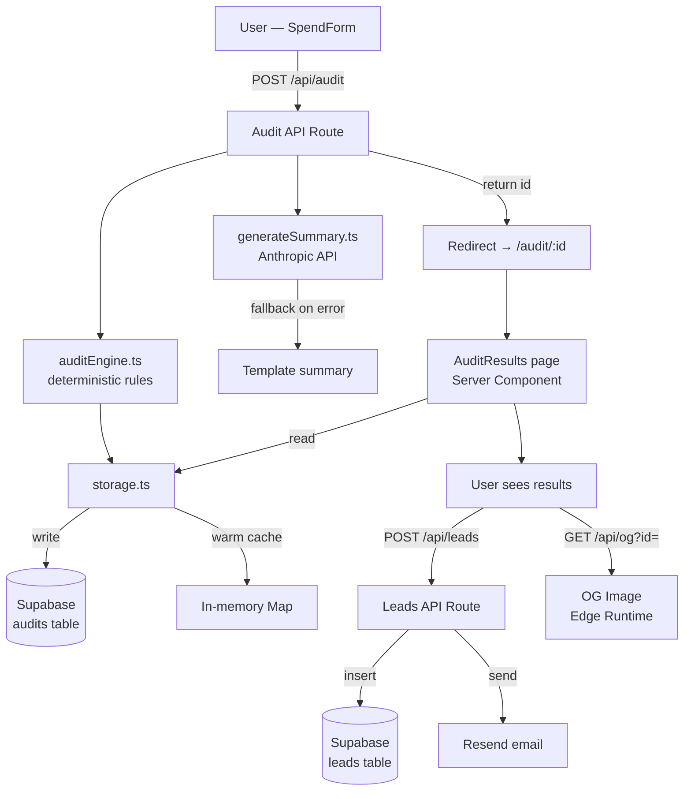

# ARCHITECTURE.md

## System Diagram

## Data Flow

1. **Input** — User fills `SpendForm`. State persists to `localStorage` on every keystroke so page reloads never lose data.

2. **Audit** — `POST /api/audit` receives `AuditFormState`. Rate-limited (5 req/min/IP) and honeypot-checked. `auditEngine.ts` runs 8 deterministic rule sets against the form data and returns `AuditSummary`. `generateSummary.ts` calls Anthropic API with the full audit context to write a prose paragraph — falls back to a template if the API is unavailable.

3. **Storage** — `storeAudit()` writes to in-memory Map (instant) and Supabase (persistent). `getAudit()` checks memory first, then Supabase. Shareable links survive server restarts because data lives in Supabase.

4. **Results** — `/audit/:id` is a Server Component. It reads the record server-side, so the full savings number is in the HTML for SEO and link previews. No client-side data fetching needed.

5. **Lead capture** — `POST /api/leads` stores email + metadata in Supabase `leads` table and triggers a Resend transactional email. High-savings leads get a Credex CTA in the email body.

6. **Open Graph** — `/api/og?id=` runs on Edge Runtime and returns a 1200×630 PNG generated by `@vercel/og`. Each audit gets a unique card showing its savings number — the viral sharing loop.

## Stack Choice

| Layer | Choice | Why |
|-------|--------|-----|
| Framework | Next.js 14 App Router | Server components, Edge runtime, easy Vercel deploy |
| Language | TypeScript strict | Financial logic needs compile-time type safety |
| Styling | Tailwind CSS | Utility-first, zero runtime, great DX |
| Database | Supabase (Postgres) | Managed, free tier sufficient, instant setup |
| Email | Resend | 100 emails/day free, excellent API |
| AI | Anthropic Claude Sonnet | Best prose quality; we already use Anthropic |
| Testing | Vitest | Faster than Jest, native ESM, same API |
| Deploy | Vercel | Zero config for Next.js, Edge functions included |

## What I'd Change at 10k Audits/Day

1. **Rate limiting** — Replace in-memory Map with Upstash Redis for distributed rate limiting across multiple Vercel instances.

2. **AI summary as background job** — Move `generateSummary` to a queue (Inngest or BullMQ). Return the audit ID immediately, stream the AI summary to the client when ready. Eliminates the 2–3s Anthropic API wait from the critical path.

3. **Audit storage** — Add a CDN cache layer for `getAudit()`. Public audit pages are immutable after creation — they can be cached at the edge indefinitely.

4. **OG image caching** — Add `Cache-Control: public, max-age=31536000, immutable` to the OG route. Right now it regenerates on every request.

5. **Supabase connection pooling** — Enable PgBouncer in Supabase settings. At 10k audits/day, direct connections will exhaust the pool.